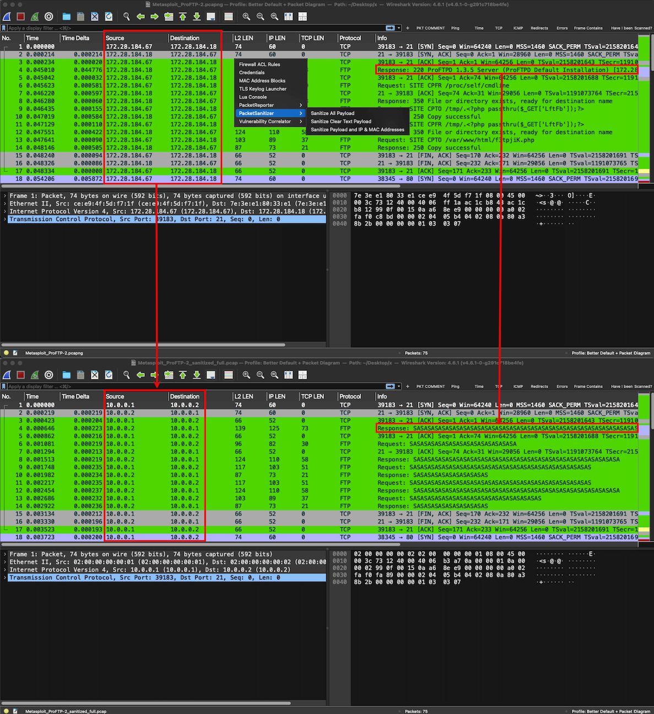
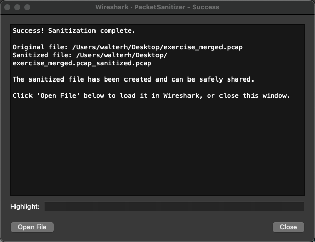

# PacketSanitizer


A Wireshark Lua plugin for sanitizing PCAP/PCAPNG files for safe sharing outside organizations.

## Description

PacketSanitizer is a Wireshark plugin that sanitizes packet capture files for safe sharing outside organizations. It offers three sanitization modes to suit different security needs:

1. **Sanitize All Payload** - Sanitizes all TCP/UDP/ICMP payloads while preserving IP and MAC addresses
2. **Sanitize Clear Text Payload** - Only sanitizes payloads from clear text protocols (HTTP, FTP, Telnet, SMTP, POP3, IMAP, DNS), leaving encrypted traffic untouched
3. **Sanitize Payload and IP & MAC Addresses** - Complete sanitization including all payloads and full IP/MAC address anonymization

### Sanitization Features

- **Anonymizing IP addresses** - Replaces all IPs with anonymized versions while maintaining conversation flows (mode 3 only)
- **Anonymizing MAC addresses** - Replaces all MAC addresses with anonymized versions (mode 3 only)
- **Removing DHCP data** - Completely removes DHCP layer information (mode 3 only)
- **Sanitizing payloads** - Replaces payload data with a recognizable pattern (0x5341 = "SA" for "Sanitized") while preserving packet size
- **Preserving structure** - Maintains full packet structure and size for analysis while removing sensitive data
- **IGMP preservation** - IGMP packets are left completely untouched to avoid malformed packet errors

The original file is preserved, and a sanitized copy is created with a mode-specific suffix.

## Screenshots

### Wireshark Menu Integration

The PacketSanitizer plugin appears in Wireshark's Tools menu with three sanitization options:



**Menu Structure:**
- **Tools → PacketSanitizer → Sanitize All Payload**
- **Tools → PacketSanitizer → Sanitize Clear Text Payload**
- **Tools → PacketSanitizer → Sanitize Payload and IP & MAC Addresses**

### Sanitization Process

When you select a sanitization mode from the Tools menu, the plugin will:
1. Detect the current capture file (or prompt you to select one)
2. Process all packets according to the selected mode
3. Display a success message with an option to open the sanitized file



### Before and After Comparison

**Before Sanitization:**
- Original IP addresses visible
- Original MAC addresses visible
- Payload data contains real information

**After Sanitization:**
- IP addresses anonymized (maintaining conversation flows)
- MAC addresses anonymized
- Payload data replaced with "SA" pattern (0x5341)
- DHCP information removed
- IGMP packets left untouched

## Installation

### Quick Install (Recommended)

We provide automated installers for macOS, Linux, and Windows that check prerequisites and install the plugin automatically.

#### macOS

```bash
cd installers/macos
./install.sh
```

#### Linux

```bash
cd installers/linux
./install.sh
```

#### Windows

```powershell
cd installers\windows
powershell -ExecutionPolicy Bypass -File install.ps1
```

The installers will:
- ✅ Check for Wireshark 3.0+
- ✅ Check for Python 3.6+
- ✅ Check for Scapy library
- ✅ Create plugin directory
- ✅ Copy plugin files
- ✅ Verify installation

For detailed installation instructions, see [installers/README.md](installers/README.md).

### Manual Installation

If you prefer to install manually:

#### Prerequisites

1. **Python 3** (3.6 or later)
2. **Scapy library**:
   ```bash
   pip3 install scapy
   ```
   
   **macOS Quick Install (if you get "externally-managed-environment" error):**
   ```bash
   pip3 install --break-system-packages scapy
   ```
   
   Or install from requirements:
   ```bash
   pip3 install -r requirements.txt
   ```

#### Wireshark Plugin Installation

**Important:** Both `PacketSanitizer.lua` and `sanitize_packets.py` must be in the same directory for the plugin to work. The Lua script automatically finds the Python script in its own directory.

1. Copy both files to your Wireshark plugins directory:
   
   **macOS/Linux:**
   ```bash
   mkdir -p ~/.local/lib/wireshark/plugins/PacketSanitizer
   cp PacketSanitizer.lua ~/.local/lib/wireshark/plugins/PacketSanitizer/
   cp sanitize_packets.py ~/.local/lib/wireshark/plugins/PacketSanitizer/
   chmod +x ~/.local/lib/wireshark/plugins/PacketSanitizer/sanitize_packets.py
   ```
   
   **Windows:**
   ```powershell
   New-Item -ItemType Directory -Path "$env:APPDATA\Wireshark\plugins\PacketSanitizer" -Force
   Copy-Item PacketSanitizer.lua "$env:APPDATA\Wireshark\plugins\PacketSanitizer\"
   Copy-Item sanitize_packets.py "$env:APPDATA\Wireshark\plugins\PacketSanitizer\"
   ```

2. Restart Wireshark

**How it works:**
- The Lua script (`PacketSanitizer.lua`) provides the Wireshark menu integration
- When you click "Tools → PacketSanitizer → Sanitize Current File", the Lua script:
  1. Finds the Python script in the same directory as the Lua script
  2. Executes `python3 sanitize_packets.py <input> <output>`
  3. Shows the result in a Wireshark text window

## Usage

1. Open a PCAP/PCAPNG file in Wireshark
2. Go to **Tools → PacketSanitizer** and select one of the three sanitization modes:
   - **Sanitize All Payload** - Creates `*_sanitized_payload.pcap`
   - **Sanitize Clear Text Payload** - Creates `*_sanitized_cleartext.pcap`
   - **Sanitize Payload and IP & MAC Addresses** - Creates `*_sanitized_full.pcap`
3. The sanitized file will be created in the same directory with a mode-specific suffix
4. The original file remains unchanged

### Sanitization Modes Explained

#### Mode 1: Sanitize All Payload
- **Use case**: When you want to remove all payload data but preserve network topology (IPs and MACs)
- **What's sanitized**: All TCP, UDP, and ICMP payloads
- **What's preserved**: IP addresses, MAC addresses, protocol headers, port numbers

#### Mode 2: Sanitize Clear Text Payload
- **Use case**: When you want to sanitize only sensitive clear text data while preserving encrypted traffic
- **What's sanitized**: Only payloads from clear text protocols (see [Plain Text Protocols](#plain-text-protocols) below)
- **What's preserved**: IP addresses, MAC addresses, encrypted traffic payloads (HTTPS, SSH, etc.)

#### Mode 3: Sanitize Payload and IP & MAC Addresses
- **Use case**: Maximum sanitization for sharing outside your organization
- **What's sanitized**: All payloads, all IP addresses, all MAC addresses, DHCP data
- **What's preserved**: Protocol structure, port numbers, packet timing

### Plain Text Protocols

The following protocols are considered "plain text" and will have their payloads sanitized in **Mode 2: Sanitize Clear Text Payload**:

- **HTTP** (ports 80, 8080, 8000, 8008, 8888) - Web traffic
- **FTP** (ports 21, 20) - File Transfer Protocol
- **Telnet** (port 23) - Remote terminal access
- **SMTP** (ports 25, 587) - Email sending
- **POP3** (ports 110, 995) - Email receiving
- **IMAP** (ports 143, 993) - Email access
- **DNS** (port 53) - Domain name queries

The plugin detects these protocols by:
1. **Port number matching** - Common ports for these protocols
2. **Payload content analysis** - Detecting protocol-specific signatures:
   - HTTP: GET, POST, PUT, DELETE, HEAD, OPTIONS methods or HTTP/1.x, HTTP/2 responses
   - FTP: USER, PASS, RETR, STOR commands
   - SMTP: EHLO, HELO, MAIL FROM:, RCPT TO: commands
   - POP3: USER, PASS, RETR, DELE commands
   - IMAP: LOGIN, SELECT, FETCH commands

**Note**: Encrypted variants (HTTPS, FTPS, SMTPS, etc.) are **not** considered plain text and will be preserved in Mode 2.

### Command Line Usage

You can also use the Python script directly:

```bash
# Mode 1: Sanitize all payloads
python3 sanitize_packets.py all_payload input.pcap output.pcap

# Mode 2: Sanitize only clear text payloads
python3 sanitize_packets.py cleartext_payload input.pcap output.pcap

# Mode 3: Full sanitization (payloads + IP/MAC addresses)
python3 sanitize_packets.py payload_and_addresses input.pcap output.pcap
```

## How It Works

### IP Address Anonymization
- All IP addresses are replaced with addresses from the `10.0.0.0/8` range
- The same original IP always maps to the same anonymized IP (maintains conversation flows)
- IPv4 and IPv6 are both supported

### MAC Address Anonymization
- All MAC addresses are replaced with locally administered MACs (`02:00:00:00:00:XX`)
- The same original MAC always maps to the same anonymized MAC (maintains device identity)

### Payload Sanitization
- TCP and UDP payloads are replaced with a sanitized pattern (0x5341: `0x53 0x41` = "SA" for "Sanitized")
- Uses printable ASCII characters (0x20-0x7E range) for better readability
- Original packet size is preserved (pattern is repeated to match original payload length)
- Full packet structure is maintained, including headers and payload space
- Packet timing and structure are preserved

### DHCP Removal
- DHCP layer is completely removed from packets
- No DHCP information is preserved in the sanitized file

## Requirements

- Wireshark 3.0 or later
- Lua support enabled in Wireshark
- Python 3.6 or later
- Scapy library

## File Structure

```
PacketSanitizer/
├── PacketSanitizer.lua    # Wireshark Lua plugin (menu integration)
├── sanitize_packets.py    # Python script (packet sanitization)
├── requirements.txt       # Python dependencies
├── README.md              # This file
├── INSTALL.md             # Detailed installation guide
├── CONTRIBUTING.md         # Contribution guidelines
├── LICENSE                 # GPL v2 license
├── VERSION                 # Version file (0.1.1)
├── examples/               # Screenshots directory
│   ├── README.md          # Screenshot documentation
│   ├── Sanitize.png       # Main menu screenshot
│   └── PacketSanitizer-Success.png  # Success dialog screenshot
└── installers/             # Platform-specific installers
    ├── README.md          # Installer documentation
    ├── macos/
    │   ├── install.sh     # macOS installer script
    │   ├── PacketSanitizer.lua
    │   └── sanitize_packets.py
    ├── linux/
    │   ├── install.sh     # Linux installer script
    │   ├── PacketSanitizer.lua
    │   └── sanitize_packets.py
    └── windows/
        ├── install.ps1    # Windows installer script (PowerShell)
        ├── PacketSanitizer.lua
        └── sanitize_packets.py
```

**How the plugin works:**
1. `PacketSanitizer.lua` is loaded by Wireshark and adds menu items under "Tools → PacketSanitizer"
2. When a mode is selected, the Lua script finds `sanitize_packets.py` in the same directory
3. The Lua script executes: `python3 sanitize_packets.py <mode> <input_file> <output_file>` (or `python` on Windows)
4. The Python script uses Scapy to sanitize the packets according to the selected mode
5. Results are shown in a Wireshark text window with an option to open the sanitized file

**Installation:**
- Use the automated installers in `installers/` for your platform (recommended)
- Or manually copy `PacketSanitizer.lua` and `sanitize_packets.py` to your Wireshark plugins directory

## Security Notes

- The sanitized file removes sensitive data but may still contain:
  - Protocol headers and structure
  - Packet timing information
  - Port numbers
  - Protocol types
- Review the sanitized file before sharing
- Consider additional sanitization for highly sensitive environments

## License

This project is licensed under the GNU General Public License v2 (GPL v2).

See [LICENSE](LICENSE) file for details.

## Contributing

See [CONTRIBUTING.md](CONTRIBUTING.md) for guidelines.

